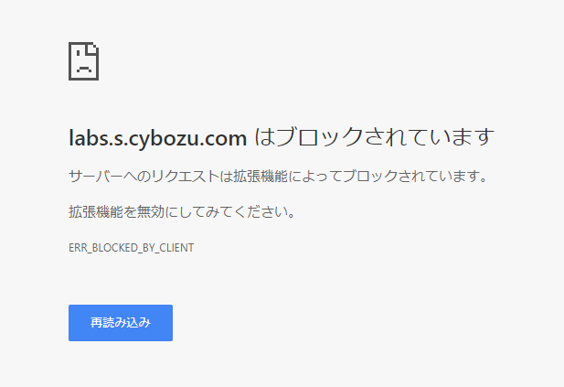

# cybozu-download suppress

[Cybozu Download Suppress]() is a Chrome Extension to disable file download from Cybozu services with specific domain names

## How it works

With this Chrome extension, when you try to download files on Cybozu services listed in domains.js, download is just cancelled. Error page will be showed which tells that the browser prohibits it.

## unit test

~~~
$ yarn test
~~~

The above command invokes Karma test runner. Karma auto-requires js modules (like as Chrome Extension env does) so test code can call them.

Karma always comes with (headless) browser, which I do not use now. Test runner without client browser would fit better for this project but I could not find.

## lint and fix

~~~
$ yarn lint
~~~

This check source code statistically.

~~~
$ yarn beautify
~~~

This one fixes checked code.

## packaging

~~~
$ yarn pack
~~~

## contribution

### site info

Send me a PR.

### translation

Please add _locales/(your locale)/messages.json , then send me a PR.

## credit

This extension is by MIT License

## CI

using CircleCI 2.0

Packed extension zip would be uploaded on artifact section on the successful build.

## deployment

### Chrome Webstore API

You need to register API and get keys manually.

[How to](https://github.com/DrewML/chrome-webstore-upload/blob/master/How%20to%20generate%20Google%20API%20keys.md)

create project: [webstore-publish]

It is not really practical. Oauth call gives you refresh token but that works only in 3600 seconds. Oauth from CircleCI(or other tool) would be complecated.

cf. [Is it possible to auto\-update a chrome extension published on the chrome web store? \- Stack Overflow](https://stackoverflow.com/questions/13139627/is-it-possible-to-auto-update-a-chrome-extension-published-on-the-chrome-web-sto/26754858)

### Firefox

[Build and Sign WebExtensions with CircleCI - mkelly\.me](http://www.mkelly.me/blog/build-and-sign-webextensions-with-circleci/)

# ToDo-es

## ToDo: force install company-wide

There might be a way to force users to install Chrome Extentions?
ref: https://sites.google.com/site/lock5stat/offline-use/installing-for-all-users

